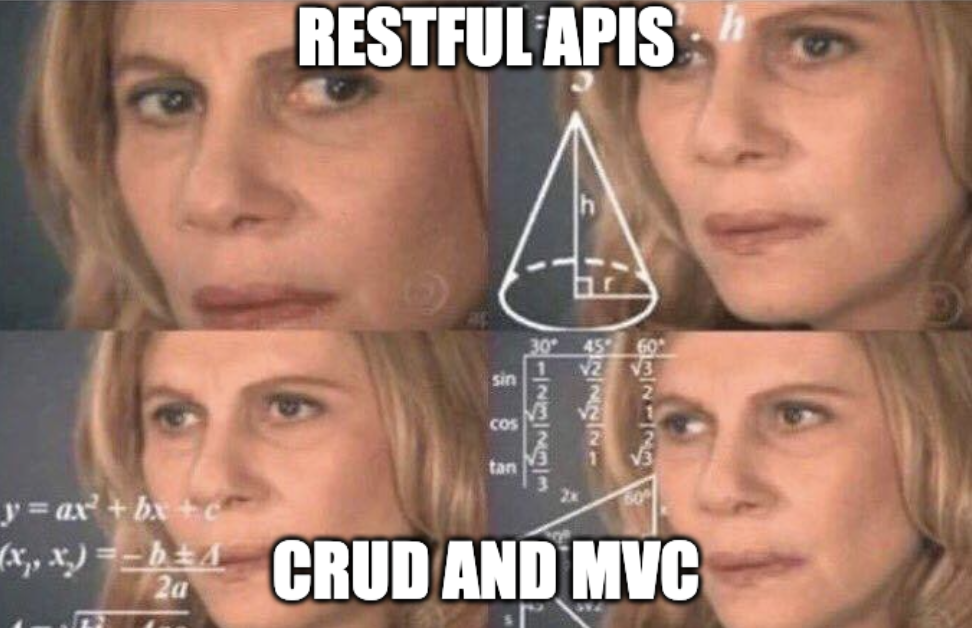
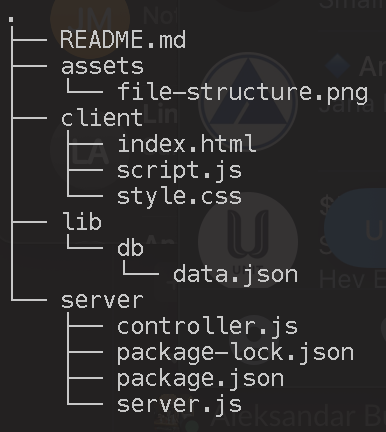

# RESTful API

Using all the hot terms, RESTful, CRUD, MVC.. all of which we now know about. You will build a [**RESTful**](https://blog.postman.com/rest-api-examples/) Express API that connects to a frontend. You should be able to **CRUD**(create, read, update and delete) on a dataset in a JSON file using your front end. Utilize the **MVC**(model, view, controller) architecture to structure your folders/files/logic.

**Note:** You're provided with brewery data as your data set. Feel free to use  your own data.

## MVC
- **Model**: Your data. In this case `JSON`, in the bonus case what lives in the MongoDB instance
- **View**: Your `HTML/CSS/JS` that runs the frontend which connects to your API using `fetch()`, and allows a user to CRUD(create, read, update, delete) on the dataset.
- **Controller**: `Node.js` and `Express` is where our logic that your routes will use to execute data operations lives. These are in order to read and write to the dataset.

## CRUD
- **Create**: The user should be able to create a resource in the JSON file.
- **Read**: The user should be able to query the JSON file to get all data and also to get single pieces of data using `id` or `name` (remember requests can be made using `url params` or a JSON `payload`)
- **Update**: The user should be able to update a given resource in the JSON file. Make sure to handle the edge case of not being able to find a given resource to update.
- **Delete**: The user should be able to delete a given piece of data. Make sure to handle case where the data cannot be found.

## RESTful API routes
At the least your app should have the following routes:
- GET `/`
- GET `/<resource>`
- GET `/<resource>/id`
- POST `/<resource>`
- PUT `/<rousource>/id`
- DELETE `/<resource>/id`

**Technical Requirements**
REMEMBER to `npm init` and `npm i <package>` your packages in your `server` folder, not root.

1. Node.js/Express RESTful API
    - GET, POST, PUT, DELETE routes
    - Needs to be seperated into a `server.js`(routes can live in the `server.js` however if you want, you can try putting them into a `routes.js` that your server uses) and a `controller.js`
2. HTML/CSS/JS front end that connects to your local API
    - HTML (semantic)
    - CSS (flexbox/grid responsive)
    - JS (buttons and input forms to read, and write to the dataset)
3. Your file structure should be:

**Deliverables**
1. Make sure your front end and back end are seperated using a `client` and `server` folder scheme. 
2. Make sure your `.json` docs live in a `lib/db` folder
3. Your API should be RESTful(refer to the RESTful resource from earlier this week)
4. Make sure to seperate your `routes` from your `controller` logic
5. Use a `.env`
6. You must have a `.gitignore` that ignores `/node_modules` and `.env`
7. You must have HTTP status codes and good error handling. Use `try/catch` statements

## Bonus

1. Use MongoDB instead of JSON. [Use this tutorial](https://www.mongodb.com/languages/javascript/mongodb-and-npm-tutorial)

2. Write tests for your backend code. [Use this tutorial](https://blog.logrocket.com/unit-integration-testing-node-js-apps/)